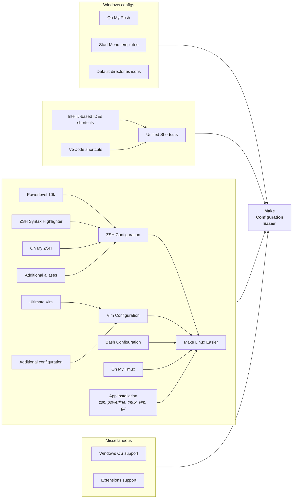

# Make Configuration Easier

# Dependency graph

```mermaid
graph LR
    subgraph MLE[" "]
        direction LR
        MLE_11["Powerlevel 10k"]
        MLE_12["ZSH Syntax Highlighter"]
        MLE_13["Oh My ZSH"]
        MLE_14["Additional aliases"]

        MLE_11 --> MLE_1
        MLE_12 --> MLE_1
        MLE_13 --> MLE_1
        MLE_14 --> MLE_1
        MLE_1["ZSH Configuration"]

        MLE_21["Ultimate Vim"]
        MLE_22["Additional configuration"]

        MLE_21 --> MLE_2
        MLE_22 --> MLE_2
        MLE_2["Vim Configuration"]

        MLE_3["Bash Configuration"]

        MLE_4["Oh My Tmux"]

        MLE_5["App installation\n<i>zsh, powerline, tmux, vim, git"]

        MLE_1 --> MLE_0
        MLE_2 --> MLE_0
        MLE_3 --> MLE_0
        MLE_4 --> MLE_0
        MLE_5 --> MLE_0
        MLE_0["Make Linux Easier"]
    end

    subgraph US[" "]
        direction LR
        US_1["IntelliJ-based IDEs shortcuts"]
        US_2["VSCode shortcuts"]

        US_1 --> US_0
        US_2 --> US_0
        US_0["Unified Shortcuts"]
    end

    subgraph WIN["Windows configs"]
        direction LR
        WIN_1["Oh My Posh"]
        WIN_2["Start Menu templates"]
        WIN_3["Default directories icons"]
    end

    subgraph MISC["Miscellaneous"]
        direction LR
        WIN_0["Windows OS support"]
        EXT["Extensions support"]
    end

    WIN --> MCE
    US --> MCE
    MLE --> MCE
    MISC --> MCE
    MCE["<b>Make\nConfiguration\nEasier</b>"]
```

